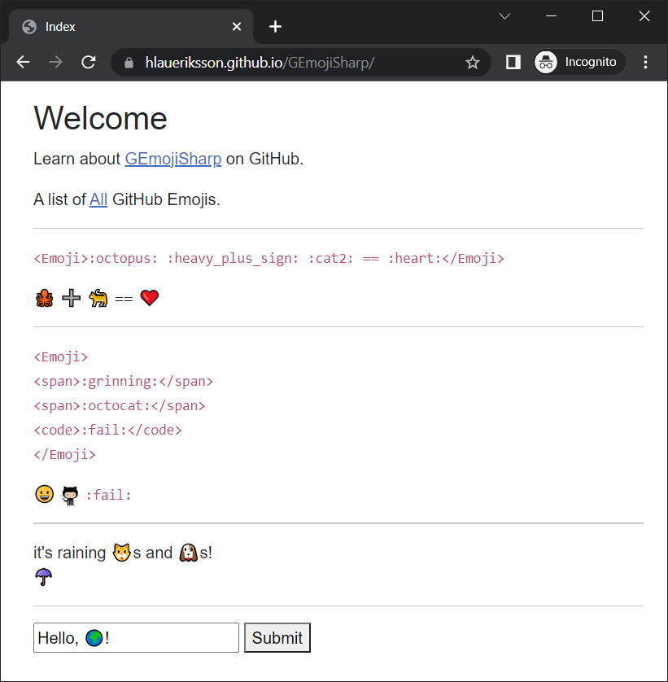

# GEmojiSharp

[](https://github.com/hlaueriksson/GEmojiSharp/actions?query=workflow%3Abuild)
[](https://www.codefactor.io/repository/github/hlaueriksson/gemojisharp)

[](https://www.nuget.org/packages/GEmojiSharp)
[](https://www.nuget.org/packages/GEmojiSharp.Blazor)
[](https://www.nuget.org/packages/GEmojiSharp.TagHelpers)

> GitHub Emoji for C# and ASP.NET Core

```
🐙 :octopus:
➕ :heavy_plus_sign:
🐈 :cat2:
⩵
❤️ :heart:
```

# Content

- [GEmojiSharp](#gemojisharp)
- [Content](#content)
- [Introduction](#introduction)
- [`GEmojiSharp` 📦](#gemojisharp-)
- [`GEmojiSharp.Blazor` 📦](#gemojisharpblazor-)
- [`GEmojiSharp.TagHelpers` 📦](#gemojisharptaghelpers-)
- [Samples](#samples)
- [Attribution](#attribution)

# Introduction

[Using emoji](https://help.github.com/en/articles/basic-writing-and-formatting-syntax#using-emoji) on GitHub is done with colons and emoji aliases:

`:+1: This PR looks great - it's ready to merge! :shipit:`

:+1: This PR looks great - it's ready to merge! :shipit:

`GEmojiSharp`, `GEmojiSharp.Blazor` and `GEmojiSharp.TagHelpers` are three libraries to make this possible in C#, Blazor and ASP.NET Core.

A list of all GitHub Emojis:

* https://github.com/hlaueriksson/github-emoji

# `GEmojiSharp` 📦

[](https://www.nuget.org/packages/GEmojiSharp/)

> GitHub Emoji for C# and .NET

Static methods:

```csharp
Emoji.Get(":tada:").Raw; // 🎉
Emoji.Raw(":tada:"); // 🎉
Emoji.Emojify(":tada: initial commit"); // 🎉 initial commit
Emoji.Find("party popper").First().Raw; // 🎉
```

Extension methods:

```csharp
":tada:".GetEmoji().Raw; // 🎉
":tada:".RawEmoji(); // 🎉
":tada: initial commit".Emojify(); // 🎉 initial commit
"party popper".FindEmojis().First().Raw; // 🎉
```

# `GEmojiSharp.Blazor` 📦

[](https://www.nuget.org/packages/GEmojiSharp.Blazor/)

> GitHub Emoji for Blazor

Update `Pages/_Host.cshtml` (Blazor Server), or `wwwroot/index.html` (Blazor WebAssembly):

```html
<link href="_content/GEmojiSharp.Blazor/style.css" rel="stylesheet" />
```

```html
<script src="_content/GEmojiSharp.Blazor/script.js"></script>
```

Import the `GEmojiSharp.Blazor` namespace in `razor` files:

```cshtml
@using GEmojiSharp.Blazor
```

Use the `<Emoji>` component to render emojis:

```html
<Emoji>:tada: initial commit</Emoji>
```

Standard emoji characters are rendered like this:

```html
<g-emoji class="g-emoji" alias="tada" fallback-src="https://github.githubassets.com/images/icons/emoji/unicode/1f389.png">🎉</g-emoji>
```

Custom GitHub emojis are rendered as images:

```html

```

# `GEmojiSharp.TagHelpers` 📦

[](https://www.nuget.org/packages/GEmojiSharp.TagHelpers/)

> GitHub Emoji for ASP.NET Core

Update the `_ViewImports.cshtml` file, to enable tag helpers in all Razor views:

```cshtml
@using GEmojiSharp.Sample.Web
@namespace GEmojiSharp.Sample.Web.Pages
@addTagHelper *, Microsoft.AspNetCore.Mvc.TagHelpers
@addTagHelper *, GEmojiSharp.TagHelpers
```

Use the `<emoji>` tag or `emoji` attribute to render emojis:

```html
<span emoji=":tada:"></span>
<emoji>:tada: initial commit</emoji>
```

Standard emoji characters are rendered like this:

```html
<g-emoji class="g-emoji" alias="tada" fallback-src="https://github.githubassets.com/images/icons/emoji/unicode/1f389.png">🎉</g-emoji>
```

Custom GitHub emojis are rendered as images:

```html

```

Use this CSS to properly position the custom GitHub emojis images:

```css
.emoji {
    background-color: transparent;
    max-width: none;
    vertical-align: text-top;
}
```

Use the JavaScript from [`g-emoji-element`](https://github.com/github/g-emoji-element) to support old browsers.

> Backports native emoji characters to browsers that don't support them by replacing the characters with fallback images.

Add a [`libman.json`](https://docs.microsoft.com/en-us/aspnet/core/client-side/libman/libman-vs?view=aspnetcore-2.2) file:

```json
{
  "version": "1.0",
  "defaultProvider": "cdnjs",
  "libraries": [
    {
      "provider": "unpkg",
      "library": "@github/g-emoji-element@1.0.0",
      "destination": "wwwroot/lib/g-emoji-element/"
    }
  ]
}
```

And add the script to the `_Layout.cshtml` file:

```html
<script src="~/lib/g-emoji-element/dist/index.umd.js"></script>
```

Do you want to use emoji anywhere, on any tag, in the `body`? Then you can use the `BodyTagHelperComponent`.

Use any tag to render emojis:

```html
<h1>Hello, :earth_africa:</h1>
```

[Registration](https://docs.microsoft.com/en-us/aspnet/core/mvc/views/tag-helpers/th-components?view=aspnetcore-2.2#registration-via-services-container) via services container:

```cs
public void ConfigureServices(IServiceCollection services)
{
    services.AddRazorPages();

    services.AddTransient<ITagHelperComponent, BodyTagHelperComponent>();
}
```

[Registration](https://docs.microsoft.com/en-us/aspnet/core/mvc/views/tag-helpers/th-components?view=aspnetcore-2.2#registration-via-razor-file) via Razor file:

```cshtml
@page
@using GEmojiSharp.TagHelpers
@using Microsoft.AspNetCore.Mvc.Razor.TagHelpers
@inject ITagHelperComponentManager manager;
@model IndexModel
@{
    ViewData["Title"] = "Home page";
    manager.Components.Add(new BodyTagHelperComponent());
}
```

[Registration](https://docs.microsoft.com/en-us/aspnet/core/mvc/views/tag-helpers/th-components?view=aspnetcore-2.2#registration-via-page-model-or-controller) via Page Model or controller:

```cs
public class IndexModel : PageModel
{
    private readonly ITagHelperComponentManager _tagHelperComponentManager;

    public IndexModel(ITagHelperComponentManager tagHelperComponentManager)
    {
        _tagHelperComponentManager = tagHelperComponentManager;
    }

    public void OnGet()
    {
        _tagHelperComponentManager.Components.Add(new BodyTagHelperComponent());
    }
}
```

# Samples

The [`samples`](/samples) folder contains...

* `GEmojiSharp.Sample.BlazorServer`, a Blazor Server app
* `GEmojiSharp.Sample.BlazorWebAssembly`, a Blazor WebAssembly app

The Blazor WebAssembly app is showcased here: https://purple-mushroom-05c6bad10.azurestaticapps.net

[](https://purple-mushroom-05c6bad10.azurestaticapps.net)

* `GEmojiSharp.Sample.Web`, a ASP.NET Core web site


# Attribution

Repositories consulted when building this:

* https://github.com/github/gemoji
* https://github.com/github/g-emoji-element
